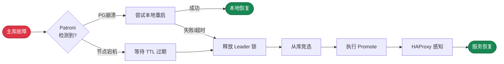

**RTO**（Recovery Time Objective，恢复时间目标）定义了在主库发生故障时，**系统恢复写入能力所需的最长时间**。

对于核心交易系统这类可用性至关重要的场景，通常要求 RTO 尽可能短，例如一分钟内。

然而更短的 RTO 指标是有代价的，它会增加误切风险：网络抖动可能被误判为故障，导致不必要的故障切换。
因此对于跨机房/跨地域部署的场景，通常需要放宽 RTO 要求（例如 1-2 分钟），以降低误切风险。

--------

## 利弊权衡

故障切换时的不可用时长上限由 [**`pg_rto`**](/docs/pgsql/param#pg_rto) 参数控制。Pigsty 提供了四种预设的 RTO 模式：
`fast`、`norm`、`safe`、`wide`，分别针对不同的网络条件与部署场景进行了优化，默认使用 `norm` 模式（约 45 秒）。
您也可以使用秒数直接指定 RTO 上限，系统会自动映射到最接近的模式。

当主库发生故障时，整个恢复流程涉及多个阶段：Patroni 检测故障、DCS 锁过期、新主选举、执行 promote、HAProxy 感知新主。
减小 RTO 意味着缩短各阶段的超时时间，这会使集群对网络抖动更加敏感，从而增加误切风险。

您需要根据实际网络条件选择合适的模式，在 **恢复速度** 与 **误切风险** 之间取得平衡。
网络质量越差，越应该选择保守的模式；网络质量越好，越可以选择激进的模式。




-----------------

## 四种模式

Pigsty 提供四种 RTO 模式，以帮助用户在不同的网络条件下进行利弊权衡。

| **名称**     |                  **fast**                  |                 **norm**                  |                 **safe**                  |                 **wide**                  |
|:-----------|:------------------------------------------:|:-----------------------------------------:|:-----------------------------------------:|:-----------------------------------------:|
| **适用场景**   |                    同机柜                     |                 同机房内（默认）                  |                   同省跨机房                   |                  跨地域/跨洲                   |
| **网络条件**   |                 < 1ms，极稳定                  |                 1-5ms，正常                  |                10-50ms，跨机房                |               100-200ms，公网                |
| **目标 RTO** | <span class="text-success">**30s**</span>  | <span class="text-primary">**45s**</span> | <span class="text-warning">**90s**</span> | <span class="text-danger">**150s**</span> |
| **误切风险**   | <span class="text-secondary">**较高**</span> | <span class="text-primary">**中等**</span>  | <span class="text-success">**较低**</span>  | <span class="text-success">**极低**</span>  |
| **配置方法**   |               `pg_rto: fast`               |              `pg_rto: norm`               |              `pg_rto: safe`               |              `pg_rto: wide`               |
{.full-width}


- 适用于网络延迟极低（< 1ms）且非常稳定的场景，例如同机柜或同交换机部署
- 平均 RTO: **14s**，最坏情况: **29s**，TTL 仅 20s，检测间隔 5s
- 对网络质量要求最高，任何抖动都可能触发切换，**误切风险较高**


- **默认模式**，适用于同机房部署，网络延迟 1-5ms，质量正常，丢包率合理
- 平均 RTO: **21s**，最坏情况: **43s**，TTL 为 30s，提供合理的容错窗口
- 平衡了恢复速度与稳定性，适合绝大多数生产环境


- 适用于同省/同区域跨机房部署，网络延迟 10-50ms，可能存在偶发抖动
- 平均 RTO: **43s**，最坏情况: **91s**，TTL 为 60s，更长的容错窗口
- 主库重启等待时间较长（60s），给予更多本地恢复机会，**误切风险较低**


- 适用于跨地域甚至跨大洲部署，网络延迟 100-200ms，可能有公网级别的丢包率
- 平均 RTO: **92s**，最坏情况: **207s**，TTL 为 120s，极宽的容错窗口
- 牺牲恢复速度换取极低的误切率，适合异地容灾场景


--------

## RTO时序图

Patroni / PG HA 有两条关键故障路径：**主动故障检测**（PG 崩溃后 Patroni 检测到并尝试重启）与 **被动租约过期**（节点宕机后等待 TTL 过期触发选举）。

<!--  -->
```js
var fmt = function(params) { if (!params || !params.length || params[0].name === '') return ''; return '<b>' + params[0].name + '</b><br/>' + params.filter(p => p.value !== '-' && p.value != null).map(p => p.marker + ' ' + p.seriesName + ': ' + p.value + 's').join('<br/>'); };
```
```yaml
tooltip: { trigger: axis, axisPointer: { type: shadow }, formatter: $fn:fmt }
legend: { top: 0, itemGap: 10, data: [租约过期, 故障检测, 重启超时, 从库检测, 抢锁提拔, 健康检查] }
grid: { left: 110, right: 24, bottom: 32, top: 40 }
xAxis: { type: value, name: 秒, nameLocation: end, max: 160, axisLine: { show: true }, axisTick: { show: true }, splitLine: { show: true, lineStyle: { type: dashed, opacity: 0.5 } }, minorTick: { show: true, splitNumber: 5 }, minorSplitLine: { show: true, lineStyle: { type: dotted, opacity: 0.2 } } }
yAxis: { type: category, axisLine: { show: true }, axisTick: { show: true }, splitLine: { show: false }, axisLabel: { fontSize: 9, fontFamily: monospace }, data: [wide-passive-max, wide-passive-avg, wide-passive-min, wide-active-max, wide-active-avg, wide-active-min, "", safe-passive-max, safe-passive-avg, safe-passive-min, safe-active-max, safe-active-avg, safe-active-min, "", norm-passive-max, norm-passive-avg, norm-passive-min, norm-active-max, norm-active-avg, norm-active-min, "", fast-passive-max, fast-passive-avg, fast-passive-min, fast-active-max, fast-active-avg, fast-active-min] }
series:
  - { name: 租约过期, type: bar, stack: main, barWidth: 16, z: 2, emphasis: { focus: series }, itemStyle: { color: "#e15759" }, data: [120, 110, 100, "-", "-", "-", "-", 60, 55, 50, "-", "-", "-", "-", 30, 27, 25, "-", "-", "-", "-", 20, 17, 15, "-", "-", "-"] }
  - { name: 故障检测, type: bar, stack: main, z: 2, emphasis: { focus: series }, itemStyle: { color: "#b07aa1" }, data: ["-", "-", "-", 20, 10, 0, "-", "-", "-", "-", 10, 5, 0, "-", "-", "-", "-", 5, 3, 0, "-", "-", "-", "-", 5, 3, 0] }
  - { name: 重启超时, type: bar, stack: main, z: 2, emphasis: { focus: series }, itemStyle: { color: "#f28e2c" }, data: ["-", "-", "-", 95, 95, 0, "-", "-", "-", "-", 45, 45, 0, "-", "-", "-", "-", 25, 25, 0, "-", "-", "-", "-", 15, 15, 0] }
  - { name: 从库检测, type: bar, stack: main, z: 2, emphasis: { focus: series }, itemStyle: { color: "#edc949" }, data: [20, 10, 0, 20, 10, 0, "-", 10, 5, 0, 10, 5, 0, "-", 5, 3, 0, 5, 3, 0, "-", 5, 3, 0, 5, 3, 0] }
  - { name: 抢锁提拔, type: bar, stack: main, z: 2, emphasis: { focus: series }, itemStyle: { color: "#59a14f" }, data: [2, 1, 0, 2, 1, 0, "-", 2, 1, 0, 2, 1, 0, "-", 2, 1, 0, 2, 1, 0, "-", 2, 1, 0, 2, 1, 0] }
  - { name: 健康检查, type: bar, stack: main, z: 2, emphasis: { focus: series }, itemStyle: { color: "#4e79a7" }, data: [8, 6, 4, 8, 6, 4, "-", 6, 5, 3, 6, 5, 3, "-", 4, 3, 2, 4, 3, 2, "-", 2, 2, 1, 2, 2, 1] }
  - { name: RTO总计, type: bar, barGap: "-100%", barWidth: 16, z: 1, itemStyle: { color: "#888", opacity: 0 }, emphasis: { itemStyle: { opacity: 0 } }, data: [150, 127, 104, 145, 122, 4, "-", 78, 66, 53, 73, 61, 3, "-", 41, 34, 27, 41, 35, 2, "-", 29, 23, 16, 29, 24, 1] }
  - { name: RTO预算, type: bar, barGap: "-100%", barWidth: 16, z: 0, itemStyle: { color: "rgba(0,0,0,0.08)" }, emphasis: { itemStyle: { color: "rgba(0,0,0,0.12)" } }, data: [150, 150, 150, 150, 150, 150, "-", 90, 90, 90, 90, 90, 90, "-", 45, 45, 45, 45, 45, 45, "-", 30, 30, 30, 30, 30, 30] }
```
<!--  -->


------

## 实现原理

四种 RTO 模式的区别在于以下 10 个 **Patroni** 与 **HAProxy** HA 相关参数如何配置。

|      组件       |             参数              | **fast** | **norm** | **safe** | **wide** | 说明               |
|:-------------:|:---------------------------:|:--------:|:--------:|:--------:|:--------:|:-----------------|
| **`patroni`** |          **`ttl`**          |    20    |    30    |    60    |   120    | Leader 锁生存时间（秒）  |
|               |       **`loop_wait`**       |    5     |    5     |    10    |    20    | HA 循环检查间隔（秒）     |
|               |     **`retry_timeout`**     |    5     |    10    |    20    |    30    | DCS 操作重试超时（秒）    |
|               | **`primary_start_timeout`** |    15    |    25    |    45    |    95    | 主库重启等待时间（秒）      |
|               |     **`safety_margin`**     |    5     |    5     |    10    |    15    | Watchdog 安全边际（秒） |
| **`haproxy`** |         **`inter`**         |    1s    |    2s    |    3s    |    4s    | 正常状态检查间隔         |
|               |       **`fastinter`**       |   0.5s   |    1s    |   1.5s   |    2s    | 状态变化期检查间隔        |
|               |       **`downinter`**       |    1s    |    2s    |    3s    |    4s    | DOWN 状态检查间隔      |
|               |         **`rise`**          |    3     |    3     |    3     |    3     | 标记 UP 所需连续成功次数   |
|               |         **`fall`**          |    3     |    3     |    3     |    3     | 标记 DOWN 所需连续失败次数 |
{.full-width}


### Patroni 参数

- **`ttl`**：Leader 锁生存时间，主库须在此时间内续租，否则锁过期触发选举，直接决定被动故障的检测延迟。
- **`loop_wait`**：Patroni 主循环间隔，每个循环执行一次健康检查与状态同步，影响故障发现的及时性。
- **`retry_timeout`**：DCS 操作重试超时，网络分区时 Patroni 在此期间持续重试，超时后主库主动降级防止脑裂。
- **`primary_start_timeout`**：PG 崩溃后 Patroni 尝试本地重启的等待时间，超时后释放 Leader 锁触发切换。
- **`safety_margin`**：Watchdog 安全边际，确保故障时有足够时间触发系统重启，避免脑裂。

### HAProxy 参数

- **`inter`**：正常状态下的健康检查间隔，服务状态稳定时使用。
- **`fastinter`**：状态变化期的检查间隔，检测到状态变化时使用更短间隔加速确认。
- **`downinter`**：DOWN 状态下的检查间隔，服务标记为 DOWN 后使用此间隔探测恢复。
- **`rise`**：标记 UP 所需连续成功次数，新主上线后需连续通过 `rise` 次检查才能接收流量。
- **`fall`**：标记 DOWN 所需连续失败次数，服务需连续失败 `fall` 次才会被标记为 DOWN。

### 关键约束

**Patroni 核心约束**：确保主库能在 TTL 过期前完成降级，防止脑裂。

```math
loop\_wait + 2 \times retry\_timeout \leq ttl
```

------

## 数据汇总


------

## 配置建议

**fast 模式** 适用于对 RTO 要求极高的场景，但需要确保网络质量足够好（延迟 < 1ms，极低丢包率）。
建议仅在同机柜或同交换机部署时使用，并在生产环境充分测试后再启用。

**norm 模式**（**默认**）是 Pigsty 默认使用的配置，对于绝大多数同机房部署的业务来说已经足够使用。
平均 21 秒的恢复时间在可接受范围内，同时提供了合理的容错窗口，避免网络抖动导致的误切。

**safe 模式** 适用于同城跨机房部署，网络延迟较高或存在偶发抖动的场景。
更长的容错窗口可以有效避免网络抖动导致的误切，是跨机房容灾的推荐配置。

**wide 模式** 适用于跨地域甚至跨大洲部署，网络延迟高且可能存在公网级别的丢包率。
这种场景下，稳定性比恢复速度更重要，因此使用极宽的容错窗口来确保极低的误切率。


|    模式     | 目标 RTO |       被动检测 RTO        |      主动检测 RTO       | 场景           |
|:---------:|:-----:|:---------------------:|:-------------------:|:-------------|
|  `fast`   | `30`  |  `16` / `23` / `29`   |  `1` / `24` / `29`  | 同交换机，高质量网络   |
|  `norm`   | `45`  |  `27` / `34` / `41`   |  `2` / `35` / `41`  | 默认，同机房，标准网络  |
|  `safe`   | `90`  |  `53` / `66` / `78`   |  `3` / `61` / `73`  | 同城双活 / 跨机房容灾 |
|  `wide`   | `150` | `104` / `127` / `150` | `4` / `122` / `145` | 异地容灾 / 跨国部署  |
| `default` | `326` |  `22` / `34` / `46`   | `2` / `314` / `326` | Patroni 默认参数 |
{.full-width}


通常只需将 [**`pg_rto`**](/docs/pgsql/param#pg_rto) 设为模式名称，Pigsty 会自动配置 Patroni 与 HAProxy 参数。
为了保持向后兼容性，Pigsty 仍然支持直接使用秒数配置 RTO，但效果相当于指定 `norm` 模式。

配置模式实际上是从 [**`pg_rto_plan`**](/docs/pgsql/param#pg_rto_plan) 中加载对应参数集，您可以修改或覆盖此配置以实现自定义 RTO 策略。

```yaml
pg_rto_plan:  # [ttl, loop, retry, start, margin, inter, fastinter, downinter, rise, fall]
  fast: [ 20  ,5  ,5  ,15 ,5  ,'1s' ,'0.5s' ,'1s' ,3 ,3 ]  # rto < 30s
  norm: [ 30  ,5  ,10 ,25 ,5  ,'2s' ,'1s'   ,'2s' ,3 ,3 ]  # rto < 45s
  safe: [ 60  ,10 ,20 ,45 ,10 ,'3s' ,'1.5s' ,'3s' ,3 ,3 ]  # rto < 90s
  wide: [ 120 ,20 ,30 ,95 ,15 ,'4s' ,'2s'   ,'4s' ,3 ,3 ]  # rto < 150s
```


